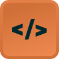

# NLW Event



## O que é o Projeto

O NLW Ignite é um projeto desenvolvido para gerenciar eventos e participantes. Ele permite criar, visualizar e gerenciar eventos, além de cadastrar e listar participantes de forma eficiente. A aplicação possui uma interface moderna e responsiva, garantindo uma ótima experiência para o usuário.

## Atualizações e mudanças que realizei.

O projeto original, é apenas o front-end da pagina Participantes.

- Adicionei o Tanstack Router, para navegar para a pagina de Eventos.
- Adicionei um botão de cadastro para ambos (Eventos e Participantes).
- Adicionei um modal para cadastro.
- Adicionei a funcionalidade de cadastrar evento e participante.
- Participante é cadastrado e vinculado de acordo com o evento.

## Tecnologias Utilizadas

- React
- TypeScript
- TailwindCSS
- Vite

## Bibliotecas Utilizadas

- @base-ui/react
- @tailwindcss/vite
- @tanstack/react-router
- class-variance-authority
- clsx
- date-fns
- lucide-react
- motion
- radix-ui
- tailwind-merge
- @faker-js/faker
- eslint
- shadcn
- tw-animate-css

## Passo a Passo para Rodar na Máquina

1. Certifique-se de ter o Node.js instalado em sua máquina.
2. Clone este repositório:
   ```bash
   git clone <URL_DO_REPOSITORIO>
   ```
3. Navegue até o diretório do projeto:
   ```bash
   cd nlw-ignite
   ```
4. Instale as dependências:
   ```bash
   npm install
   ```
5. Inicie o servidor de desenvolvimento:
   ```bash
   npm run dev
   ```
6. Acesse a aplicação no navegador através do endereço fornecido pelo Vite (geralmente `http://localhost:3000`).
